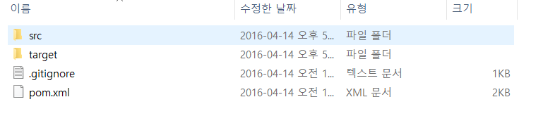
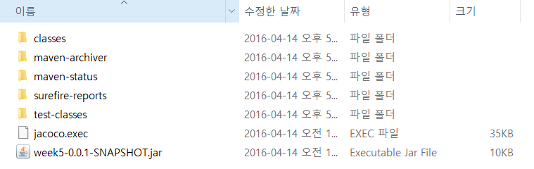
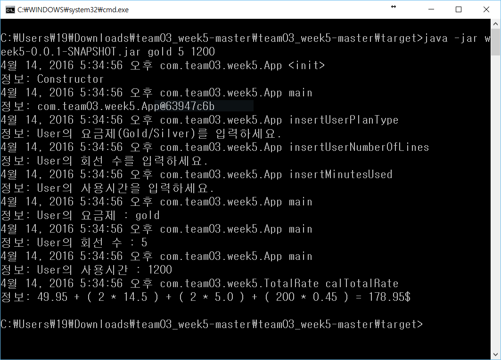
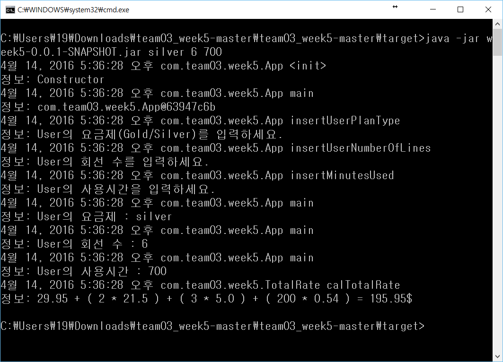
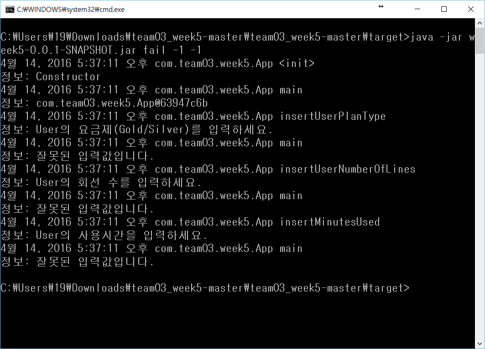

#전화요금 고지서 계산 프로그램
    이 프로그램은 전화 요금 고지서를 발행해주는 프로그램이다. 
    java기반 console 프로그램이며 사용자에게 계산된 요금을 상세하게 보여준다. 
    
##jenkins - 프로젝트 설정
###Version
  	JDK : 1.8
  	SonarQube : 5.4
  	Jenkins : 1.654
###Build
	Root POM : pom.xml
	Goals and options : clean org.jacoco:jacoco-maven-plugin:prepare-agent install
###Post Steps
	Invoke Standalone SonarQube Analysis
		JDK : 1.8+
		Analysis properties : sonar.projectKey=Team03_week5
	  	                      sonar.projectName=Team03_week5
		                      sonar.projectVersion=0.0.1
	                  	      sonar.sources=src
		JVM Options : -Xmx500m -XX:MaxPermSize=100m

###구성
	App.java : main 함수를 포함한 클래스로 사용자 인터페이스는 console 화면으로 실행된다.
	User.java : 사용자 정보를 담고 있는 클래스로 App.java에 입력받아 user객체로 저장한다.
	PlanType.java : 요금제의 상위 클래스로 상속받아 실제 요금제의 정보를 입력할 수 있다.
	Gold.java : Gold 요금제에 대한 정보를 담고 있는 클래스로 PanType 클래스를 상속받는다.
	Silver.java : Silver 요금제에 대한 정보를 담고 있는 클래스로 PanType 클래스를 상속받는다.
	TotalRate.java : 사용자 객체와 요금제 객체를 이용해 실제 청구될 금액을 계산해 준다.

#실행 방법

###1. Downloads the project
  git clone 명령어나 download .zip을 이용해 로컬 저장소로 프로젝트를 다운 받습니다.
  
  
###2. go to the target folder
  

###4. Excute
	command prompt : java -jar week4-0.0.1-SNAPSHOT.jar [Plantype] [Numberofline] [Minutesused]
      - Plantype : gold | silver (Ignorecase)
      - Numberofline : Positive Integer
      - Minutesused : Positive Integer
  
  
  
